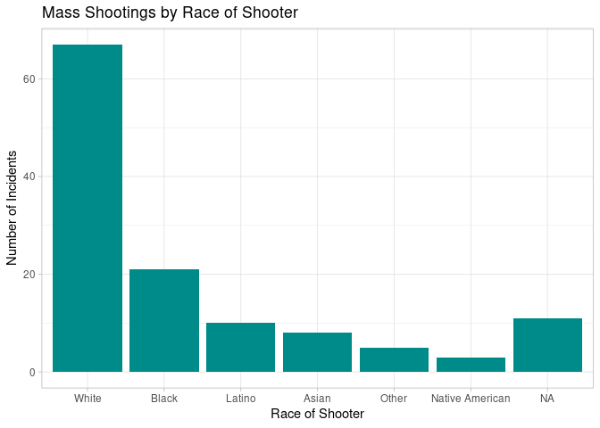
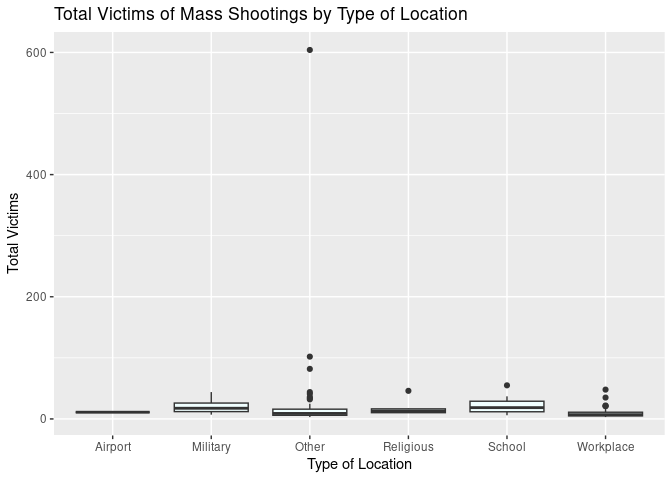
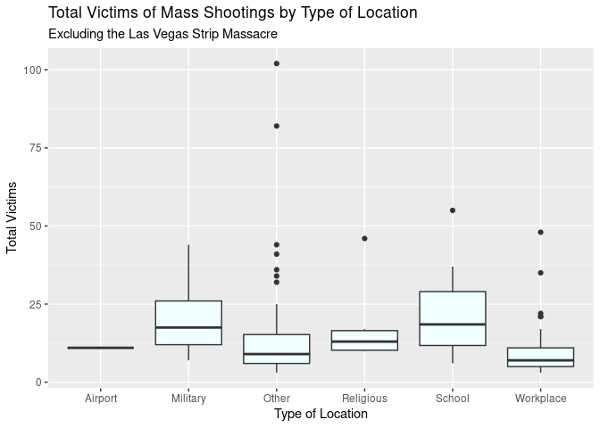
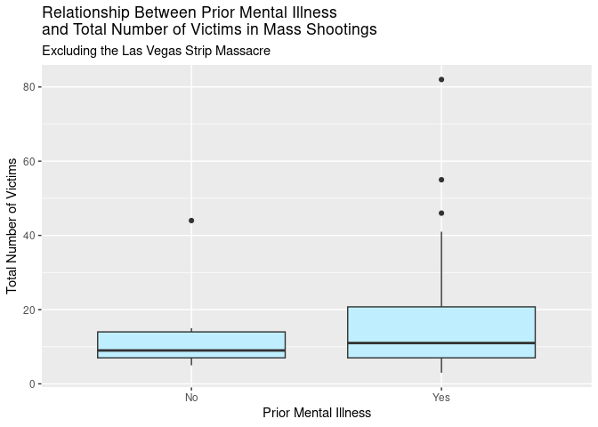
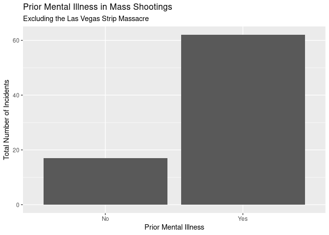
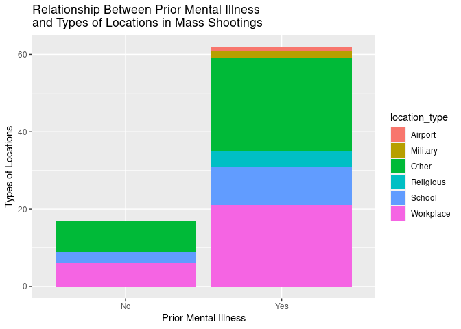
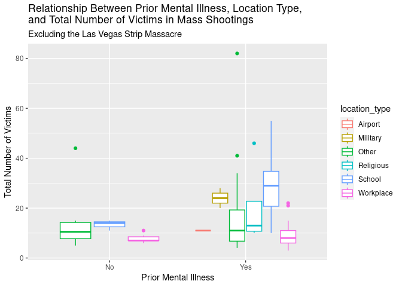
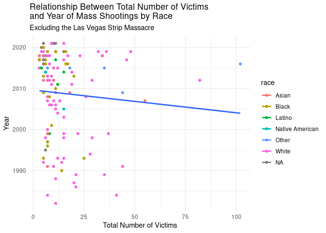

## Get the data

    # load tidyverse packages
    library(tidyverse)  

    ## ── Attaching packages ─────────────────────────────────────── tidyverse 1.3.2 ──
    ## ✔ ggplot2 3.4.0     ✔ purrr   1.0.2
    ## ✔ tibble  3.2.1     ✔ dplyr   1.1.4
    ## ✔ tidyr   1.3.0     ✔ stringr 1.5.1
    ## ✔ readr   2.1.5     ✔ forcats 0.5.2
    ## ── Conflicts ────────────────────────────────────────── tidyverse_conflicts() ──
    ## ✖ dplyr::filter() masks stats::filter()
    ## ✖ dplyr::lag()    masks stats::lag()

    # load package for formatting tables
    library(knitr)      

    # get data from rcis package
    library(rcis)

    # load data
    data("mass_shootings")
    mass_shootings

    ## # A tibble: 125 × 14
    ##    case       year month   day location summary fatalities injured total_victims
    ##    <chr>     <dbl> <chr> <int> <chr>    <chr>        <dbl>   <dbl>         <dbl>
    ##  1 Oxford H…  2021 Nov      30 Oxford,… "Ethan…          4       7            11
    ##  2 San Jose…  2021 May      26 San Jos… "Samue…          9       0             9
    ##  3 FedEx wa…  2021 Apr      15 Indiana… "Brand…          8       7            15
    ##  4 Orange o…  2021 Mar      31 Orange,… "Amina…          4       1             5
    ##  5 Boulder …  2021 Mar      22 Boulder… "Ahmad…         10       0            10
    ##  6 Atlanta …  2021 Mar      16 Atlanta… "Rober…          8       1             9
    ##  7 Springfi…  2020 Mar      16 Springf… "Joaqu…          4       0             4
    ##  8 Molson C…  2020 Feb      26 Milwauk… "Antho…          5       0             5
    ##  9 Jersey C…  2019 Dec      10 Jersey … "David…          4       3             7
    ## 10 Pensacol…  2019 Dec       6 Pensaco… "Ahmed…          3       8            11
    ## # ℹ 115 more rows
    ## # ℹ 5 more variables: location_type <chr>, male <lgl>, age_of_shooter <dbl>,
    ## #   race <chr>, prior_mental_illness <chr>

    glimpse(mass_shootings)

    ## Rows: 125
    ## Columns: 14
    ## $ case                 <chr> "Oxford High School shooting", "San Jose VTA shoo…
    ## $ year                 <dbl> 2021, 2021, 2021, 2021, 2021, 2021, 2020, 2020, 2…
    ## $ month                <chr> "Nov", "May", "Apr", "Mar", "Mar", "Mar", "Mar", …
    ## $ day                  <int> 30, 26, 15, 31, 22, 16, 16, 26, 10, 6, 31, 4, 3, …
    ## $ location             <chr> "Oxford, Michigan", "San Jose, California", "Indi…
    ## $ summary              <chr> "Ethan Crumbley, a 15-year-old student at Oxford …
    ## $ fatalities           <dbl> 4, 9, 8, 4, 10, 8, 4, 5, 4, 3, 7, 9, 22, 3, 12, 5…
    ## $ injured              <dbl> 7, 0, 7, 1, 0, 1, 0, 0, 3, 8, 25, 27, 26, 12, 4, …
    ## $ total_victims        <dbl> 11, 9, 15, 5, 10, 9, 4, 5, 7, 11, 32, 36, 48, 15,…
    ## $ location_type        <chr> "School", "Workplace", "Workplace", "Workplace", …
    ## $ male                 <lgl> TRUE, TRUE, TRUE, TRUE, TRUE, TRUE, TRUE, TRUE, T…
    ## $ age_of_shooter       <dbl> 15, 57, 19, NA, 21, 21, 31, 51, NA, NA, 36, 24, 2…
    ## $ race                 <chr> NA, NA, "White", NA, NA, "White", NA, "Black", "B…
    ## $ prior_mental_illness <chr> NA, "Yes", "Yes", NA, "Yes", NA, NA, NA, NA, NA, …

    ?mass_shootings

## Specific questions

#### 1. Generate a data frame that summarizes the number of mass shootings per year. Print the data frame as a formatted `kable()` table. Refer to the homework description on the website for guidance on using this function.

    shootings_per_year <- count(mass_shootings, year) %>% 
      kable(
        caption = "Mass Shootings per Year",
        col.names = c("Year", "Number of Incidents"))
    shootings_per_year

<table>
<caption>Mass Shootings per Year</caption>
<thead>
<tr class="header">
<th style="text-align: right;">Year</th>
<th style="text-align: right;">Number of Incidents</th>
</tr>
</thead>
<tbody>
<tr class="odd">
<td style="text-align: right;">1982</td>
<td style="text-align: right;">1</td>
</tr>
<tr class="even">
<td style="text-align: right;">1984</td>
<td style="text-align: right;">2</td>
</tr>
<tr class="odd">
<td style="text-align: right;">1986</td>
<td style="text-align: right;">1</td>
</tr>
<tr class="even">
<td style="text-align: right;">1987</td>
<td style="text-align: right;">1</td>
</tr>
<tr class="odd">
<td style="text-align: right;">1988</td>
<td style="text-align: right;">1</td>
</tr>
<tr class="even">
<td style="text-align: right;">1989</td>
<td style="text-align: right;">2</td>
</tr>
<tr class="odd">
<td style="text-align: right;">1990</td>
<td style="text-align: right;">1</td>
</tr>
<tr class="even">
<td style="text-align: right;">1991</td>
<td style="text-align: right;">3</td>
</tr>
<tr class="odd">
<td style="text-align: right;">1992</td>
<td style="text-align: right;">2</td>
</tr>
<tr class="even">
<td style="text-align: right;">1993</td>
<td style="text-align: right;">4</td>
</tr>
<tr class="odd">
<td style="text-align: right;">1994</td>
<td style="text-align: right;">1</td>
</tr>
<tr class="even">
<td style="text-align: right;">1995</td>
<td style="text-align: right;">1</td>
</tr>
<tr class="odd">
<td style="text-align: right;">1996</td>
<td style="text-align: right;">1</td>
</tr>
<tr class="even">
<td style="text-align: right;">1997</td>
<td style="text-align: right;">2</td>
</tr>
<tr class="odd">
<td style="text-align: right;">1998</td>
<td style="text-align: right;">3</td>
</tr>
<tr class="even">
<td style="text-align: right;">1999</td>
<td style="text-align: right;">5</td>
</tr>
<tr class="odd">
<td style="text-align: right;">2000</td>
<td style="text-align: right;">1</td>
</tr>
<tr class="even">
<td style="text-align: right;">2001</td>
<td style="text-align: right;">1</td>
</tr>
<tr class="odd">
<td style="text-align: right;">2003</td>
<td style="text-align: right;">1</td>
</tr>
<tr class="even">
<td style="text-align: right;">2004</td>
<td style="text-align: right;">1</td>
</tr>
<tr class="odd">
<td style="text-align: right;">2005</td>
<td style="text-align: right;">2</td>
</tr>
<tr class="even">
<td style="text-align: right;">2006</td>
<td style="text-align: right;">3</td>
</tr>
<tr class="odd">
<td style="text-align: right;">2007</td>
<td style="text-align: right;">4</td>
</tr>
<tr class="even">
<td style="text-align: right;">2008</td>
<td style="text-align: right;">3</td>
</tr>
<tr class="odd">
<td style="text-align: right;">2009</td>
<td style="text-align: right;">4</td>
</tr>
<tr class="even">
<td style="text-align: right;">2010</td>
<td style="text-align: right;">1</td>
</tr>
<tr class="odd">
<td style="text-align: right;">2011</td>
<td style="text-align: right;">3</td>
</tr>
<tr class="even">
<td style="text-align: right;">2012</td>
<td style="text-align: right;">7</td>
</tr>
<tr class="odd">
<td style="text-align: right;">2013</td>
<td style="text-align: right;">5</td>
</tr>
<tr class="even">
<td style="text-align: right;">2014</td>
<td style="text-align: right;">4</td>
</tr>
<tr class="odd">
<td style="text-align: right;">2015</td>
<td style="text-align: right;">7</td>
</tr>
<tr class="even">
<td style="text-align: right;">2016</td>
<td style="text-align: right;">6</td>
</tr>
<tr class="odd">
<td style="text-align: right;">2017</td>
<td style="text-align: right;">11</td>
</tr>
<tr class="even">
<td style="text-align: right;">2018</td>
<td style="text-align: right;">12</td>
</tr>
<tr class="odd">
<td style="text-align: right;">2019</td>
<td style="text-align: right;">10</td>
</tr>
<tr class="even">
<td style="text-align: right;">2020</td>
<td style="text-align: right;">2</td>
</tr>
<tr class="odd">
<td style="text-align: right;">2021</td>
<td style="text-align: right;">6</td>
</tr>
</tbody>
</table>

Mass Shootings per Year

#### 2. Create a bar chart that identifies the number of mass shooters associated with each race category. Order the bars from highest to lowest (check the lecture on Factors on this). Ensure the chart includes appropriate labels, an informative title, and anything else you would like to include to enhance its visual appeal.

    ggplot(
      data = mass_shootings,
      mapping = aes(
        x = fct_infreq(race))) +
      geom_bar(fill = "cyan4") +
      labs(
        title = "Mass Shootings by Race of Shooter",
        x = "Race of Shooter",
        y = "Number of Incidents") +
      theme_light()

#### 3. Create a boxplot to visualize the number of total victims by type of location. Then, remove the Las Vegas Strip massacre from the dataset and redraw the same plot. Ensure each chart includes appropriate labels, an informative title, and anything else you would like to include to enhance its visual layout.

    ggplot(
      data = mass_shootings,
      mapping = aes(
        x = location_type,
        y = total_victims)) +
      geom_boxplot(fill = "azure") +
      labs(
        title = "Total Victims of Mass Shootings by Type of Location",
        x = "Type of Location",
        y = "Total Victims") +
      theme_grey()

      mass_shootings %>% 
      filter(case != "Las Vegas Strip massacre") %>% 
      ggplot(
        mapping = aes(
          x = location_type,
          y = total_victims)) +
      geom_boxplot(fill = "azure") +
      labs(
        title = "Total Victims of Mass Shootings by Type of Location",
        subtitle = "Excluding the Las Vegas Strip Massacre",
        x = "Type of Location",
        y = "Total Victims") +
        theme_grey()

#### 4. How many white males with prior signs of mental illness initiated a mass shooting after (and not including) 2000? Display the result as a single number, no graph needed.

    filter(mass_shootings, 
           male == "TRUE", 
           prior_mental_illness == "Yes", 
           year > 2000) %>% 
      summarize(total = n())

    ## # A tibble: 1 × 1
    ##   total
    ##   <int>
    ## 1    41

## More open-ended questions

#### 5. Do mass shootings involving shooters with signs of mental illness differ from those involving shooters without signs of mental illness? Your analysis should include three graphs, though you may include more if desired: one examining the relationship between mental illness and the total number of victims; another between mental illness and type of location; and a third displaying all three variables (mental illness, type of location, and total victims). Pick the graphs you think are the most appropriate, given the variables you are working with. Experiment with different types of graphs before finalizing your choices. Exclude from the graphs any data points with missing information or outliers that could make the visualization less effecitve. Ensure each visualization includes clear labels, an informative title, and any additional elements you would like to add to enhance its visual layout. Along with the graphs, provide a 1-2 paragraph interpretation of them. Note that graphs alone will not be sufficient to fully answer this question.

    mass_shootings %>% 
      filter(case != "Las Vegas Strip massacre") %>% 
      drop_na(prior_mental_illness) %>% 
      ggplot(
        mapping = aes(
          x = prior_mental_illness,
          y = total_victims)) +
      geom_boxplot(fill = "lightblue1") +
      labs(
        title = "Relationship Between Prior Mental Illness \nand Total Number of Victims in Mass Shootings",
        subtitle = "Excluding the Las Vegas Strip Massacre",
        x = "Prior Mental Illness",
        y = "Total Number of Victims")

    mass_shootings %>% 
      filter(case != "Las Vegas Strip massacre") %>% 
      drop_na(prior_mental_illness) %>% 
      ggplot(
        mapping = aes(
          x = prior_mental_illness)) +
      geom_bar() +
      labs(
        title = "Prior Mental Illness in Mass Shootings",
        subtitle = "Excluding the Las Vegas Strip Massacre",
        x = "Prior Mental Illness",
        y = "Total Number of Incidents")

From the generated boxplot, we can infer that perpetrators of mass
shootings with a history of mental illness have a broader range of the
total number of victims that they injure or kill per shooting. Shooters
with prior mental illness have the highest median number of victims,
meaning they, on average, hurt the most people. Shooters with no prior
mental illness have a lower median. From the generated bar graph, we can
see that shooters with a history of mental illness have committed far
more shootings than shooters without prior mental illness. Together, we
can infer that the whiskers and the interquartile range in the boxplot
for ‘Yes’ represent a large number of shootings where these victims are
being shot.

    mass_shootings %>% 
        drop_na(prior_mental_illness) %>% 
      ggplot(
        mapping = aes(
          x = prior_mental_illness,
          fill = location_type)) +
      geom_bar(position = "stack") +
      labs(
        title = "Relationship Between Prior Mental Illness \nand Types of Locations in Mass Shootings",
        x = "Prior Mental Illness",
        y = "Types of Locations")

From the generated graph, we can infer that shooters with prior mental
illness not only have committed more mass shootings from the sheer
number of locations that these mass shootings have occurred, but also
that shooters with prior mental illness have higher variability in the
types of locations they shoot up. Shooters with prior mental illness
have committed mass shootings in every location type in the dataset,
while shooters with no prior mental illness only include shootings at
workplaces, schools, and other types of locations. This category ‘Other’
is the most frequent type of location where mass shootings occur,
appearing as the largest amount for all three categories of shooter
prior mental illness, followed closely by ‘Workplace’.

    mass_shootings %>% 
      filter(case != "Las Vegas Strip massacre") %>% 
      drop_na(prior_mental_illness) %>% 
      ggplot(
        mapping = aes(
          x = prior_mental_illness,
          y = total_victims,
          color = location_type)) +
      geom_boxplot() +
      labs(
        title = "Relationship Between Prior Mental Illness, Location Type, \nand Total Number of Victims in Mass Shootings",
        subtitle = "Excluding the Las Vegas Strip Massacre",
        x = "Prior Mental Illness",
        y = "Total Number of Victims")

From the generated graph, we can infer that shooters with a history of
prior mental illness have hurt the highest number of victims. We can see
that the previously interpreted location type of ‘Other’ having the
highest number of shootings among other location types has few total
victims per shooting in the interquartile range with high outliers for
each category of shooters’ prior mental illness. Therefore, even though
‘Other’ location types are the most frequent location where mass
shootings occur, these mass shootings are not very deadly, only hurting
a few people per shooting. This is different from schools, where the
interquartile range for yes and no prior mental illness is the highest,
meaning these shootings are the deadliest. The military is the second
deadliest location for yes prior mental illness. The workplace, which
appeared to be the second most common location type for mass shootings
in the previous graph, represents the least deadly shootings, with the
lowest number of victims, represented by both the lowest interquartile
range and the lowest median, for both shooters with and without prior
mental illness.

#### 6. Generate one question that interests you (of similar complexity to the question above but with different variables) and answer it by creating one or two graphs. Exclude from the graph(s) any data points with missing information or outliers that could make the visualization less effecitve. Ensure the visualization(s) includes clear labels, an informative title, and any additional elements you would like to add to enhance its visual layout. Along with the graph(s), provide a 1-2 paragraph interpretation. Note that the graph(s) alone will not be sufficient to fully answer this question.

What is the relationship between the total number of victims and the
year that the mass shooting occurs? Are mass shootings becoming more
deadly? How does race play a factor in the potentially increasing
deadliness of mass shootings?

    mass_shootings %>% 
      filter(case != "Las Vegas Strip massacre") %>% 
      ggplot(
        mapping = aes(
          x = total_victims,
          y = year,
          color = race)) +
      geom_point() +
      geom_smooth(aes(color = NULL), method = "lm", se = FALSE) + 
      labs(
        title = "Relationship Between Total Number of Victims \nand Year of Mass Shootings by Race",
        subtitle = "Excluding the Las Vegas Strip Massacre",
        x = "Total Number of Victims",
        y = "Year") +
      theme_minimal()

    ## `geom_smooth()` using formula = 'y ~ x'

From the generated graph, we can infer that the frequency of mass
shootings has increased substantially from 1980 to 2020. It is not
clear, however, if mass shootings are becoming more deadly with more
total victims per shooting as time goes on, as although there are more
data points in the 2010-20s, only three data points exceed 50 total
victims. Yes, these data points are later in time, but there is not an
overall positive relationship between total number of victims and year.
In fact, according to the trend line, there is a slight negative
correlation between these two variables, with the total victim count
slightly decreasing as time increases. With regard to race, most of the
data points represent white shooters, but racial diversity of shooters
increase as time increases. Therefore mass shootings are not only more
common recently, but are more likely to be committed by a diverse
population, still with a majority of shooters being white. However, they
are not becoming more deadly per shooting - though perhaps they are
becoming more deadly overall with the incidence of mass shootings
increasing in frequency.

## Session Info

    sessioninfo::session_info()

    ## ─ Session info ───────────────────────────────────────────────────────────────
    ##  setting  value
    ##  version  R version 4.4.1 (2024-06-14)
    ##  os       Red Hat Enterprise Linux 8.10 (Ootpa)
    ##  system   x86_64, linux-gnu
    ##  ui       X11
    ##  language (EN)
    ##  collate  en_US.UTF-8
    ##  ctype    en_US.UTF-8
    ##  tz       America/Chicago
    ##  date     2024-10-16
    ##  pandoc   2.17.1.1 @ /usr/lib/rstudio-server/bin/quarto/bin/ (via rmarkdown)
    ## 
    ## ─ Packages ───────────────────────────────────────────────────────────────────
    ##  package       * version date (UTC) lib source
    ##  assertthat      0.2.1   2019-03-21 [2] CRAN (R 4.2.1)
    ##  backports       1.4.1   2021-12-13 [2] CRAN (R 4.2.1)
    ##  broom           1.0.1   2022-08-29 [2] CRAN (R 4.2.1)
    ##  cellranger      1.1.0   2016-07-27 [2] CRAN (R 4.2.1)
    ##  cli             3.6.3   2024-06-21 [2] CRAN (R 4.4.1)
    ##  colorspace      2.0-3   2022-02-21 [2] CRAN (R 4.2.1)
    ##  crayon          1.5.2   2022-09-29 [2] CRAN (R 4.2.1)
    ##  DBI             1.1.3   2022-06-18 [2] CRAN (R 4.2.1)
    ##  dbplyr          2.2.1   2022-06-27 [2] CRAN (R 4.2.1)
    ##  digest          0.6.30  2022-10-18 [2] CRAN (R 4.2.1)
    ##  dplyr         * 1.1.4   2023-11-17 [2] CRAN (R 4.4.0)
    ##  evaluate        0.18    2022-11-07 [2] CRAN (R 4.2.1)
    ##  fansi           1.0.6   2023-12-08 [2] CRAN (R 4.4.0)
    ##  farver          2.1.1   2022-07-06 [2] CRAN (R 4.2.1)
    ##  fastmap         1.2.0   2024-05-15 [2] CRAN (R 4.4.0)
    ##  forcats       * 0.5.2   2022-08-19 [2] CRAN (R 4.2.1)
    ##  fs              1.5.2   2021-12-08 [2] CRAN (R 4.2.1)
    ##  gargle          1.2.1   2022-09-08 [2] CRAN (R 4.2.1)
    ##  generics        0.1.3   2022-07-05 [2] CRAN (R 4.2.1)
    ##  ggplot2       * 3.4.0   2022-11-04 [2] CRAN (R 4.2.1)
    ##  glue            1.7.0   2024-01-09 [2] CRAN (R 4.4.0)
    ##  googledrive     2.0.0   2021-07-08 [2] CRAN (R 4.2.1)
    ##  googlesheets4   1.0.1   2022-08-13 [2] CRAN (R 4.2.1)
    ##  gtable          0.3.1   2022-09-01 [2] CRAN (R 4.2.1)
    ##  haven           2.5.1   2022-08-22 [2] CRAN (R 4.2.1)
    ##  highr           0.11    2024-05-26 [2] CRAN (R 4.4.1)
    ##  hms             1.1.3   2023-03-21 [2] CRAN (R 4.3.0)
    ##  htmltools       0.5.8.1 2024-04-04 [2] CRAN (R 4.4.0)
    ##  httr            1.4.4   2022-08-17 [2] CRAN (R 4.2.1)
    ##  jsonlite        1.8.3   2022-10-21 [2] CRAN (R 4.2.1)
    ##  knitr         * 1.48    2024-07-07 [2] CRAN (R 4.4.1)
    ##  labeling        0.4.2   2020-10-20 [2] CRAN (R 4.2.1)
    ##  lattice         0.22-6  2024-03-20 [2] CRAN (R 4.4.1)
    ##  lifecycle       1.0.4   2023-11-07 [2] CRAN (R 4.4.0)
    ##  lubridate       1.9.0   2022-11-06 [2] CRAN (R 4.2.1)
    ##  magrittr        2.0.3   2022-03-30 [2] CRAN (R 4.2.1)
    ##  Matrix          1.7-0   2024-04-26 [2] CRAN (R 4.4.1)
    ##  mgcv            1.9-1   2023-12-21 [2] CRAN (R 4.4.1)
    ##  modelr          0.1.9   2022-08-19 [2] CRAN (R 4.2.1)
    ##  munsell         0.5.0   2018-06-12 [2] CRAN (R 4.2.1)
    ##  nlme            3.1-164 2023-11-27 [2] CRAN (R 4.4.1)
    ##  pillar          1.9.0   2023-03-22 [2] CRAN (R 4.3.0)
    ##  pkgconfig       2.0.3   2019-09-22 [2] CRAN (R 4.2.1)
    ##  purrr         * 1.0.2   2023-08-10 [2] CRAN (R 4.4.0)
    ##  R6              2.5.1   2021-08-19 [2] CRAN (R 4.2.1)
    ##  rcis          * 0.2.5   2024-08-20 [2] Github (css-materials/rcis@c0a0358)
    ##  readr         * 2.1.5   2024-01-10 [2] CRAN (R 4.4.0)
    ##  readxl          1.4.1   2022-08-17 [2] CRAN (R 4.2.1)
    ##  reprex          2.0.2   2022-08-17 [2] CRAN (R 4.2.1)
    ##  rlang           1.1.4   2024-06-04 [2] CRAN (R 4.4.1)
    ##  rmarkdown       2.28    2024-08-17 [2] CRAN (R 4.4.1)
    ##  rstudioapi      0.14    2022-08-22 [2] CRAN (R 4.2.1)
    ##  rvest           1.0.3   2022-08-19 [2] CRAN (R 4.2.1)
    ##  scales          1.2.1   2022-08-20 [2] CRAN (R 4.2.1)
    ##  sessioninfo     1.2.2   2021-12-06 [2] CRAN (R 4.2.1)
    ##  stringi         1.8.4   2024-05-06 [2] CRAN (R 4.4.0)
    ##  stringr       * 1.5.1   2023-11-14 [2] CRAN (R 4.4.0)
    ##  tibble        * 3.2.1   2023-03-20 [2] CRAN (R 4.3.0)
    ##  tidyr         * 1.3.0   2023-01-24 [2] CRAN (R 4.2.2)
    ##  tidyselect      1.2.1   2024-03-11 [2] CRAN (R 4.4.0)
    ##  tidyverse     * 1.3.2   2022-07-18 [2] CRAN (R 4.2.1)
    ##  timechange      0.1.1   2022-11-04 [2] CRAN (R 4.2.1)
    ##  tzdb            0.4.0   2023-05-12 [2] CRAN (R 4.3.0)
    ##  utf8            1.2.4   2023-10-22 [2] CRAN (R 4.4.0)
    ##  vctrs           0.6.5   2023-12-01 [2] CRAN (R 4.4.0)
    ##  withr           3.0.0   2024-01-16 [2] CRAN (R 4.4.0)
    ##  xfun            0.47    2024-08-17 [2] CRAN (R 4.4.1)
    ##  xml2            1.3.3   2021-11-30 [2] CRAN (R 4.2.1)
    ##  yaml            2.3.6   2022-10-18 [2] CRAN (R 4.2.1)
    ## 
    ##  [1] /home/sophieennis/R/x86_64-redhat-linux-gnu-library/4.4
    ##  [2] /usr/lib64/R/library
    ##  [3] /usr/share/R/library
    ## 
    ## ──────────────────────────────────────────────────────────────────────────────

## Reflections & Resources

Write 1-2 paragraph reflecting on what was difficult and/or easy about
this homework assignment. Discuss the problems you encountered and how
you solved them, and new concepts or techniques you learned.

Please list the first and last names of any collaborators you worked
with to complete this assignment.

Additionally, list the resources you used and provide the links,
including how you utilized them (if you only used in-class resources,
just say so, you do not need to list them).

Kindly remember that you are not allowed to use AI tools to generate R
code for this and future assignments. The only acceptable uses of AI
tools are for debugging (but only after you have made an attempt on your
own) and for generating examples of how to use a specific function (but
also check the function documentation and course materials).

If you use AI, please explain how and be as specific as possible (e.g.,
“I used \[tool name\] to debug question 2 of HW2,” or “I asked for
suggestions on how to use `factor()` to reorder the bars in a bar graph
and what data type the input data should be”). Refer to the website
(under this homework description and FAQs) for more on our AI and
plagiarism policy. We conduct random checks on submitted code, and while
we trust this won’t be needed, any copied code will result in penalties.

### Reflection

I learned how to use kable() in Question 1 from the instructions for the
homework, which will be useful for tabulating data in the future. It was
very easy to apply it to the present dataset once I was familiar with
the technique. I had a lot of trouble understanding where to put
fct\_infreq() in Question 2 and tried a few different methods, like
using mutate() and a pipe, but it didn’t generate a properly ordered bar
chart like the method I ultimately used did. It was relatively easy to
filter out data for Question 3 using filter(), though I was concerned
with how my first graph looked at first before I realized that the goal
of the second graph was to eliminate the outlier to make the graph more
visually appealing. It then made sense to eliminate this outlier for
most of the graphs I generated moving forward. Question 4 made a lot of
sense intuitively to me, but I went about it incorrectly at first and
used count(filter()) instead of summarize(), which makes more sense to
use in this scenario. I really enjoyed Question 5 because of how similar
it was to the in class activity we did of figuring out which type of
graph to use, and it was fun to figure out which types of graphs worked
best. I did accidentally use a grouped bar chart instead of a boxplot
with colors for the last part of Question 5 because I was using the same
logic as the previous part, but I corrected this mistake. I had to
remember how to properly interpret box plots for Question 5, which was
difficult at first but got easier with practice. Answering Question 5
set me up well for Question 6, because I played with a few different
variables and testing out their corresponding graph types to see what
looked the best and most clear. At first I did a faceted scatterplot,
but liked the look of a scatterplot with colors better and liked how the
racial categories interacted within one graph.

### Resources

-   I used the instructions in the homework to learn how to generate a
    table with kable() for Question 1.
-   After looking over the lecture slides on when to use fct\_infreq(),
    I used
    [forcats](https://forcats.tidyverse.org/reference/fct_inorder.html)
    to understand how to use it for Question 2.
-   I looked at the lecture slides for help on Question 3.
-   After answering Question 4 using count(filter()), I asked ChatGPT if
    my answer was efficient. It suggested I use summarize() instead of
    count() because count() returns a data frame.
-   I consulted what other students said in the [Lecture 4
    CodeShare](codeshare.io) to understand how to stack bar plots for
    Question 5.
-   I debugged with ChatGPT on Question 6 after my trend line
    corresponded with each race category instead of one summarizing
    trend line, and it suggested I use geom\_smooth(aes(color = NULL)).
-   I used
    [NCEAS](https://www.nceas.ucsb.edu/sites/default/files/2020-04/colorPaletteCheatsheet.pdf)
    to look up available colors in R to fill my plots with.
-   I used
    [R-bloggers](https://www.r-bloggers.com/2016/08/ggplot2-themes-examples/)
    to look up available themes in R to make my plots more visually
    appealing.
